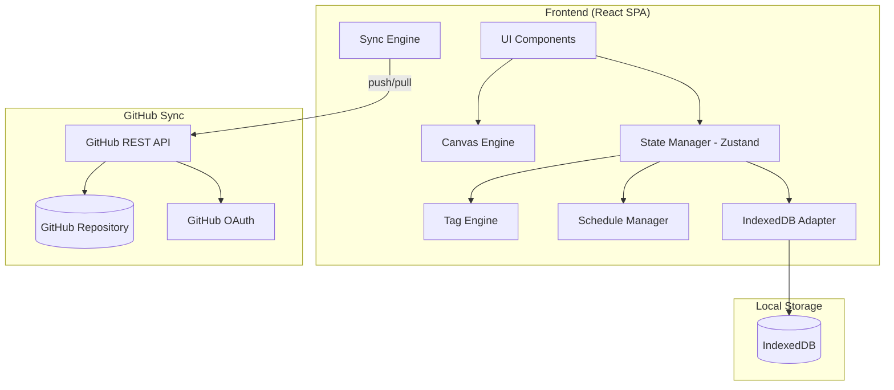
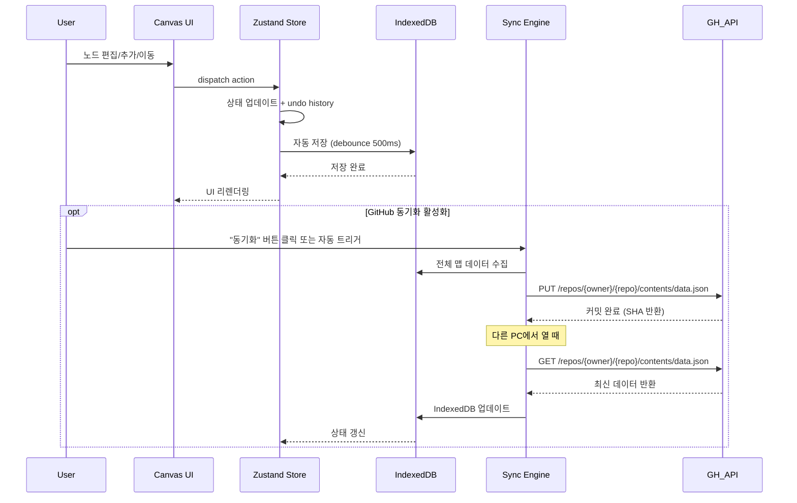

# ThinkNode — 마인드맵 & 순서도 통합 설계 도구

> XMind 컨셉 기반의 차세대 마인드맵 프로그램. 태그 기반 크로스맵 통합 조회, 일정 관리, 순서도 변환을 지원한다.

**문서 정보**
- 작성일: 2026-05-22
- 작성자: Monday (Feature Forge)
- 버전: 1.0
- 상태: Phase 6 — 개발 전달 완료 ✅

---

## 1. 개요 (Overview)

### 기능 설명
사용자가 마우스 드래그앤드롭과 키보드 단축키로 마인드맵을 작성/편집하고, 해시태그 기반으로 여러 마인드맵의 노드를 통합 조회/병합하며, 노드별 due date를 설정하여 타임라인으로 관리하고, 마인드맵을 순서도로 변환할 수 있는 웹 애플리케이션.

### 해결하는 문제
- **단일 맵 제한**: XMind는 개별 마인드맵만 볼 수 있어 맵 간 중첩 콘텐츠를 병합/비교할 수 없음
- **태그/검색 부재**: 해시태그 기반 검색이나 필터링 기능이 없어 대량의 마인드맵에서 원하는 정보를 찾기 어려움
- **일정 관리 부재**: 마인드맵 노드에 due date를 설정하고 추적할 수 없음
- **순서도 미지원**: 마인드맵과 순서도를 별도 도구로 관리해야 하는 불편

### 대상 사용자

| 사용자 그룹 | 역할 | 필요성 |
|-----------|------|--------|
| Boss (개인 사용자) | 초기 사용자, 프로덕트 피드백 제공 | 마인드맵 + 일정 관리 통합 도구 필요 |
| 향후 일반 사용자 | 검증 후 공개 전환 시 | 직관적이고 강력한 마인드맵 도구 |

### 비즈니스 가치
- **생산성 향상**: 마인드맵, 일정, 순서도를 하나의 도구로 통합
- **지식 관리**: 태그 기반 크로스맵 통합으로 분산된 아이디어를 연결
- **경쟁 차별화**: XMind에 없는 태그 통합/일정/순서도 변환 기능

---

## 2. 기능 요구사항 (Functional Requirements)

### 2.1 마인드맵 코어 (Priority: P0)

| ID | EARS 요구사항 | 우선순위 |
|----|-------------|---------|
| FR-001 | The system shall 캔버스에 루트 노드를 생성하고 트리 구조로 자식 노드를 추가/삭제/편집할 수 있어야 한다 | P0 |
| FR-002 | When 사용자가 노드를 드래그할 때, the system shall 노드와 하위 트리를 60fps 이상으로 이동하고 연결선을 재배치해야 한다 | P0 |
| FR-003 | When 사용자가 노드를 선택하고 키보드로 텍스트를 입력할 때, the system shall 인라인 편집 모드로 전환하여 노드 내용을 수정할 수 있게 해야 한다 | P0 |
| FR-004 | When 사용자가 노드 내용을 변경할 때, the system shall 변경 사항을 500ms 이내에 로컬 스토리지에 자동 저장해야 한다 | P0 |
| FR-005 | The system shall 마인드맵별로 이름, 생성일, 수정일, 설명 메타데이터를 관리해야 한다 | P0 |
| FR-006 | When 사용자가 Undo(Ctrl+Z) 또는 Redo(Ctrl+Shift+Z)를 실행할 때, the system shall 최근 50개 작업까지 되돌리거나 다시 적용해야 한다 | P0 |
| FR-007 | The system shall 마인드맵의 레이아웃을 자동 정렬(auto-layout)하는 기능을 제공해야 한다 | P1 |
| FR-008 | Where 사용자가 테마/스타일 설정을 변경하면, the system shall 노드 색상, 폰트, 연결선 스타일을 즉시 반영해야 한다 | P1 |

### 2.2 태그 기반 통합 조회 (Priority: P0)

| ID | EARS 요구사항 | 우선순위 |
|----|-------------|---------|
| FR-101 | When 사용자가 노드에 해시태그(#태그명)를 입력할 때, the system shall 태그를 자동 인식하고 태그 인덱스에 등록해야 한다 | P0 |
| FR-102 | When 사용자가 태그를 검색할 때, the system shall 모든 마인드맵에서 해당 태그가 포함된 노드 목록을 반환해야 한다 | P0 |
| FR-103 | When 사용자가 특정 태그로 "통합 뷰"를 요청할 때, the system shall 여러 마인드맵에서 해당 태그가 달린 노드들을 하나의 가상 마인드맵으로 병합하여 표시해야 한다 | P0 |
| FR-104 | When 사용자가 전체 마인드맵에서 필터를 적용할 때, the system shall 태그, 텍스트, 날짜 조건으로 노드를 필터링하여 표시해야 한다 | P0 |
| FR-105 | When 두 마인드맵에서 동일한 태그를 가진 노드가 발견되고 노드 제목의 텍스트 유사도가 70% 이상일 때, the system shall 중복 노드를 자동 감지하고 병합 제안을 표시해야 한다 | P1 |

### 2.3 일정 관리 (Priority: P1)

| ID | EARS 요구사항 | 우선순위 |
|----|-------------|---------|
| FR-201 | When 사용자가 노드에 due date를 설정할 때, the system shall 날짜 피커를 표시하고 선택한 날짜를 노드 메타데이터로 저장해야 한다 | P1 |
| FR-202 | While 노드에 due date가 설정되어 있을 때, the system shall 노드에 날짜 배지를 표시하고 기한 임박(3일 이내) 시 시각적 경고를 표시해야 한다 | P1 |
| FR-203 | When 사용자가 타임라인 뷰를 요청할 때, the system shall due date가 설정된 모든 노드를 시간순으로 간트 차트 형태로 표시해야 한다 | P1 |
| FR-204 | If 노드의 due date가 오늘 또는 이전인 경우, the system shall 해당 노드를 "기한 초과" 상태로 표시해야 한다, else 남은 일수를 표시해야 한다 | P1 |
| FR-205 | When 사용자가 타임라인 뷰에서 노드를 클릭할 때, the system shall 해당 노드가 속한 마인드맵으로 이동하고 노드를 하이라이트해야 한다 | P1 |

### 2.4 순서도 (Priority: P2)

| ID | EARS 요구사항 | 우선순위 |
|----|-------------|---------|
| FR-301 | The system shall 순서도 전용 캔버스를 제공하여 시작/종료, 프로세스, 판단, 입출력 등 표준 순서도 도형을 배치할 수 있어야 한다 | P2 |
| FR-302 | When 사용자가 순서도 노드 간 연결선을 그릴 때, the system shall 방향 화살표와 조건 레이블을 지원해야 한다 | P2 |
| FR-303 | When 사용자가 마인드맵에서 "순서도로 변환"을 실행할 때, the system shall 마인드맵의 계층 구조를 기반으로 순서도 초안을 자동 생성해야 한다 | P2 |
| FR-304 | The system shall 마인드맵과 순서도를 별도 문서로 관리하되, 프로젝트 단위로 그룹핑해야 한다 | P2 |

### 2.5 데이터 관리 (Priority: P0)

| ID | EARS 요구사항 | 우선순위 |
|----|-------------|---------|
| FR-401 | The system shall 마인드맵 데이터를 로컬(IndexedDB)에 우선 저장하고 오프라인에서도 편집 가능해야 한다 | P0 |
| FR-402 | Where GitHub 동기화가 활성화되면, the system shall GitHub OAuth로 인증하고 지정된 저장소에 마인드맵 데이터를 JSON으로 push/pull해야 한다 | P1 |
| FR-403 | When 로컬(IndexedDB)과 GitHub 데이터의 타임스탬프가 다를 때, the system shall 충돌을 감지하고 사용자에게 "로컬 유지/GitHub 유지/수동 병합" 선택지를 제공해야 한다 | P1 |
| FR-404 | When 사용자가 마인드맵을 JSON 파일로 내보내기할 때, the system shall 전체 맵 구조, 태그, 일정 메타데이터를 포함한 JSON 파일을 생성해야 한다 | P1 |
| FR-405 | When 사용자가 JSON 파일을 가져오기할 때, the system shall 파일을 파싱하여 마인드맵으로 복원해야 한다 | P1 |

---

## 3. 비기능 요구사항 (Non-Functional Requirements)

| 카테고리 | 요구사항 | 목표값 | 검증 방법 |
|---------|---------|--------|---------|
| 성능 | 마인드맵 로드 시간 (200 노드) | < 1초 | Chrome DevTools |
| 성능 | 노드 드래그 렌더링 | 60fps | Performance Monitor |
| 성능 | 자동 저장 지연 | < 500ms | 타이머 검증 |
| 성능 | 태그 검색 응답 (1000개 노드 기준) | < 300ms | 성능 테스트 |
| 확장성 | 마인드맵 최대 수 | 수백 개 | IndexedDB 용량 테스트 |
| 확장성 | 맵 당 최대 노드 수 | 200개 | 렌더링 성능 테스트 |
| 가용성 | 오프라인 편집 지원 | 100% | Service Worker 검증 |
| 브라우저 | 지원 범위 | Chrome 120+, Firefox 121+, Safari 17+ | 크로스 브라우저 테스트 |
| 접근성 | 키보드 네비게이션 | 전체 기능 접근 가능 | WCAG 2.1 AA |
| 유지보수 | 코드 커버리지 | > 80% | Jest 리포트 |

---

## 4. 아키텍처 설계 (Architecture Design)

### 패턴 선택

**선택: Monolith (SPA + Optional API Server)**

초기 개인용 버전은 프론트엔드 SPA 중심으로 개발하고, 로컬 저장소(IndexedDB)를 사용한다. 클라우드 동기화가 필요해지면 경량 API 서버를 추가한다.

### 컴포넌트 구조



### 데이터 흐름



### Architecture Decision Record (ADR)

| ADR ID | 제목 | 결정 사항 | 근거 |
|--------|------|---------|------|
| ADR-001 | 캔버스 렌더링 엔진 | React Flow (reactflow.dev) | 노드 기반 UI 전문 라이브러리, 드래그앤드롭 내장, 커스텀 노드 지원, MIT 라이선스 |
| ADR-002 | 상태 관리 | Zustand | 가볍고 빠름, React 외부에서도 접근 가능, undo/redo 미들웨어 지원 |
| ADR-003 | 로컬 저장소 | IndexedDB (via Dexie.js) | 대용량 구조화 데이터 저장, 오프라인 지원, 브라우저 네이티브 |
| ADR-007 | 동기화 방식 | GitHub Repository + REST API | Boss가 이미 GitHub 사용 중, 서버 불필요, 무료, 버전 히스토리 자동 관리 |
| ADR-004 | 스타일링 | Tailwind CSS + shadcn/ui | 빠른 개발, 일관된 디자인 시스템, 커스터마이징 용이 |
| ADR-005 | 순서도 엔진 | React Flow (마인드맵과 동일) | 마인드맵과 순서도 모두 노드-엣지 그래프이므로 동일 엔진 사용 가능 |
| ADR-006 | 빌드 도구 | Vite | 빠른 HMR, TypeScript 네이티브, 번들 최적화 |

---

## 5. 3관점 설계 (Three-Perspective Design)

### [Frontend] 프론트엔드 관점

**컴포넌트 트리:**
```
App
├── Sidebar
│   ├── MapList (마인드맵 목록)
│   ├── TagExplorer (태그 탐색기)
│   └── TimelineToggle (타임라인 뷰 전환)
├── Toolbar
│   ├── UndoRedoButtons
│   ├── ZoomControls
│   ├── LayoutButton (자동 정렬)
│   ├── ThemeSelector
│   └── ExportButton
├── MainCanvas
│   ├── MindMapCanvas (React Flow 기반)
│   │   ├── MindMapNode (커스텀 노드)
│   │   │   ├── NodeContent (텍스트 편집)
│   │   │   ├── TagBadges (#태그 표시)
│   │   │   ├── DueDateBadge (일정 배지)
│   │   │   └── NodeActions (추가/삭제 버튼)
│   │   └── MindMapEdge (커스텀 연결선)
│   ├── FlowchartCanvas (순서도 캔버스)
│   └── MergedViewCanvas (태그 통합 뷰)
├── RightPanel
│   ├── NodeProperties (노드 상세 편집)
│   ├── TagManager (태그 관리)
│   ├── DatePicker (일정 설정)
│   └── StyleEditor (스타일 편집)
├── TimelineView
│   └── GanttChart (간트 차트)
├── SearchOverlay
│   ├── TagSearch
│   └── FullTextSearch
└── MergeSuggestionDialog (병합 제안)
```

**상태 관리 (Zustand Store):**
```typescript
interface ThinkNodeStore {
  // 맵 관리
  maps: Map<string, MindMap>;
  activeMapId: string | null;
  
  // 노드/엣지
  nodes: Node[];
  edges: Edge[];
  
  // 태그 인덱스
  tagIndex: Map<string, TagEntry[]>; // tag → [{mapId, nodeId, content}]
  
  // 일정
  scheduledNodes: ScheduledNode[];
  
  // UI 상태
  selectedNodeId: string | null;
  viewMode: 'mindmap' | 'flowchart' | 'merged' | 'timeline';
  theme: ThemeConfig;
  
  // Undo/Redo
  history: HistoryEntry[];
  historyIndex: number;
  
  // Actions
  addNode: (parentId: string, content: string) => void;
  deleteNode: (nodeId: string) => void;
  updateNode: (nodeId: string, data: Partial<NodeData>) => void;
  moveNode: (nodeId: string, position: Position) => void;
  addTag: (nodeId: string, tag: string) => void;
  setDueDate: (nodeId: string, date: Date) => void;
  searchByTag: (tag: string) => TagEntry[];
  getMergedView: (tag: string) => MergedMap;
  undo: () => void;
  redo: () => void;
}
```

**클라이언트 검증:**

| 검증 유형 | 규칙 | 사용자 메시지 |
|----------|------|------------|
| 노드 제목 | 최대 200자 | "노드 제목은 200자까지 입력 가능합니다" |
| 태그 이름 | 영문, 한글, 숫자, _, - / 최대 50자 | "태그는 영문, 한글, 숫자, _, -만 사용 가능합니다" |
| Due date | 유효한 날짜 형식 (YYYY-MM-DD) | "올바른 날짜 형식을 입력해주세요" |
| 맵 이름 | 필수, 최대 100자 | "마인드맵 이름을 입력해주세요" |
| JSON import | 유효한 ThinkNode JSON 스키마 | "올바른 ThinkNode 파일이 아닙니다" |

**키보드 단축키:**

| 단축키 | 동작 |
|--------|------|
| Tab | 자식 노드 추가 |
| Enter | 형제 노드 추가 |
| Delete/Backspace | 노드 삭제 |
| F2 | 노드 편집 모드 |
| Ctrl+Z | Undo |
| Ctrl+Shift+Z | Redo |
| Ctrl+S | 수동 저장 (자동 저장 외) |
| Ctrl+F | 검색 오버레이 |
| Ctrl+/ | 단축키 도움말 |

### [Backend] 데이터 동기화 관점 (GitHub 기반, 서버리스)

**별도 백엔드 서버 없음** — GitHub REST API를 직접 호출하여 동기화

**GitHub API 사용 엔드포인트:**
```
# 인증 (GitHub OAuth)
GET  https://github.com/login/oauth/authorize     # OAuth 인증 시작
POST https://github.com/login/oauth/access_token   # 토큰 발급

# 데이터 동기화 (GitHub Contents API)
GET  /repos/{owner}/thinknode-data/contents/maps/   # 맵 목록 조회
GET  /repos/{owner}/thinknode-data/contents/maps/{mapId}.json  # 맵 데이터 pull
PUT  /repos/{owner}/thinknode-data/contents/maps/{mapId}.json  # 맵 데이터 push (커밋)
DELETE /repos/{owner}/thinknode-data/contents/maps/{mapId}.json # 맵 삭제

# 메타데이터
GET  /repos/{owner}/thinknode-data/contents/index.json  # 전체 인덱스 (맵 목록, 태그 인덱스)
PUT  /repos/{owner}/thinknode-data/contents/index.json  # 인덱스 업데이트
```

**GitHub 저장소 데이터 구조:**
```
thinknode-data/          ← Boss의 GitHub 저장소 (private)
├── index.json           ← 마인드맵 목록 + 태그 인덱스 + 메타데이터
├── maps/
│   ├── {mapId-1}.json   ← 마인드맵 1 (노드, 엣지, 태그, 일정 포함)
│   ├── {mapId-2}.json   ← 마인드맵 2
│   └── ...
└── settings.json        ← 사용자 설정 (테마, 환경설정)
```

**맵 JSON 스키마 (maps/{mapId}.json):**
```json
{
  "id": "uuid",
  "name": "프로젝트 계획",
  "description": "",
  "type": "mindmap",
  "theme": "light",
  "updatedAt": "2026-05-22T10:00:00Z",
  "nodes": [
    {
      "id": "node-uuid",
      "parentId": null,
      "content": "루트 노드",
      "position": { "x": 0, "y": 0 },
      "style": {},
      "tags": ["#프로젝트"],
      "dueDate": "2026-06-15",
      "order": 0
    }
  ],
  "edges": [
    {
      "id": "edge-uuid",
      "source": "node-1",
      "target": "node-2",
      "label": "",
      "type": "default"
    }
  ]
}
```

**동기화 흐름:**
```
[Push] 로컬 → GitHub
1. IndexedDB에서 변경된 맵 데이터 수집
2. JSON 직렬화
3. GitHub Contents API로 PUT (base64 인코딩)
4. 커밋 메시지 자동 생성 ("sync: update {mapName}")
5. 반환된 SHA를 로컬에 저장 (충돌 감지용)

[Pull] GitHub → 로컬
1. GitHub Contents API로 GET (index.json 먼저)
2. 로컬과 SHA 비교 → 변경된 맵만 개별 다운로드
3. JSON 역직렬화 → IndexedDB 업데이트
4. Zustand Store 갱신 → UI 반영

[충돌 감지]
1. Push 시 로컬 SHA ≠ GitHub 최신 SHA → 충돌
2. 사용자에게 "로컬 유지 / GitHub 유지 / 수동 병합" 선택 제공
```

### [Security] 보안 관점

**데이터 분류:**
- 처리 데이터: 내부 (개인 마인드맵 콘텐츠)
- 민감도: 중간
- 규정: 향후 공개 시 개인정보보호법 적용 가능

**인증 (GitHub 동기화 시):**
- GitHub OAuth 2.0 (PKCE flow, SPA에 적합)
- Access Token은 메모리에만 보관 (localStorage 사용 금지)
- 동기화 기능 사용 시에만 인증 필요
- 로컬 전용 사용 시 인증 불필요

**입력 검증:**
- 노드 내용: 최대 10,000자, HTML 태그 이스케이핑
- 태그: 정규식 `/^[a-zA-Z가-힣0-9_-]{1,50}$/`
- JSON import: 스키마 검증 + 최대 파일 크기 50MB
- XSS 방지: DOMPurify로 사용자 입력 새니타이징

**로컬 데이터 보안:**
- IndexedDB 데이터는 브라우저 Same-Origin Policy로 보호
- 민감 데이터(클라우드 토큰)는 메모리에만 보관

---

## 6. 인수 기준 (Acceptance Criteria)

### 마인드맵 코어

| ID | 유형 | Given | When | Then |
|----|------|-------|------|------|
| AC-001 | Happy | 빈 캔버스가 표시된 상태에서 | "새 마인드맵" 버튼을 클릭할 때 | 루트 노드가 생성되고 이름 입력 모드로 전환된다 |
| AC-002 | Happy | 노드가 선택된 상태에서 | Tab 키를 누를 때 | 선택된 노드의 자식 노드가 생성되고 편집 모드로 전환된다 |
| AC-003 | Happy | 노드가 선택된 상태에서 | Enter 키를 누를 때 | 같은 레벨의 형제 노드가 생성된다 |
| AC-004 | Happy | 노드를 드래그할 때 | 다른 노드 위로 드롭할 때 | 드래그한 노드가 드롭 대상의 자식으로 이동하고 연결선이 업데이트된다 |
| AC-005 | Happy | 노드 내용을 수정한 후 | 500ms가 경과하면 | IndexedDB에 자동 저장되고 저장 인디케이터가 표시된다 |
| AC-006 | Happy | 여러 작업을 수행한 후 | Ctrl+Z를 누를 때 | 마지막 작업이 취소되고 이전 상태로 복원된다 |
| AC-007 | Edge | 200개 노드가 있는 마인드맵을 | 처음 로드할 때 | 1초 이내에 전체 맵이 렌더링된다 |
| AC-008 | Edge | 노드를 드래그하면서 | 빠르게 이동할 때 | 60fps를 유지하며 끊김 없이 렌더링된다 |

### 테마/스타일

| ID | 유형 | Given | When | Then |
|----|------|-------|------|------|
| AC-009 | Happy | 테마 설정에서 "Dark" 테마를 | 선택할 때 | 캔버스 배경, 노드 색상, 연결선 색상이 Dark 테마로 즉시 반영된다 |
| AC-010 | Happy | 노드를 선택하고 스타일 편집기에서 | 노드 배경색을 변경할 때 | 해당 노드에만 커스텀 색상이 적용되고 다른 노드는 영향받지 않는다 |

### 태그 통합

| ID | 유형 | Given | When | Then |
|----|------|-------|------|------|
| AC-101 | Happy | 노드 편집 모드에서 | "#프로젝트"를 입력할 때 | "프로젝트" 태그가 자동 인식되어 태그 배지로 표시되고 태그 인덱스에 등록된다 |
| AC-102 | Happy | 3개의 마인드맵에 "#urgent" 태그가 있을 때 | 태그 탐색기에서 "#urgent"를 클릭할 때 | 3개 맵에서 해당 태그가 달린 모든 노드가 목록으로 표시된다 |
| AC-103 | Happy | 태그 통합 뷰를 요청할 때 | "#프로젝트" 태그로 병합 뷰를 생성할 때 | 여러 맵의 "#프로젝트" 노드가 하나의 가상 마인드맵으로 표시된다 |
| AC-104 | Happy | 두 마인드맵에 "#디자인" 태그가 있고 노드 제목의 텍스트 유사도가 70% 이상일 때 | 병합 제안을 확인할 때 | "유사 노드 발견: 병합하시겠습니까?" 다이얼로그가 원본/대상 노드 비교와 함께 표시된다 |
| AC-105 | Edge | 태그가 없는 마인드맵에서 | 태그 검색을 실행할 때 | "태그가 설정된 노드가 없습니다" 메시지가 표시된다 |

### 일정 관리

| ID | 유형 | Given | When | Then |
|----|------|-------|------|------|
| AC-201 | Happy | 노드가 선택된 상태에서 | 우측 패널에서 due date를 "2026-06-01"로 설정할 때 | 노드에 "6/1" 날짜 배지가 표시되고 타임라인 뷰에 추가된다 |
| AC-202 | Happy | due date가 3일 이내인 노드가 있을 때 | 마인드맵을 열 때 | 해당 노드의 날짜 배지가 주황색(경고)으로 표시된다 |
| AC-203 | Happy | due date가 오늘 이전인 노드가 있을 때 | 마인드맵을 열 때 | 해당 노드의 날짜 배지가 빨간색(초과)으로 표시된다 |
| AC-204 | Happy | 여러 노드에 due date가 설정된 상태에서 | 타임라인 뷰로 전환할 때 | 간트 차트 형태로 모든 일정이 시간순으로 표시된다 |
| AC-205 | Happy | 타임라인 뷰에서 | 특정 노드를 클릭할 때 | 해당 마인드맵이 열리고 해당 노드가 하이라이트된다 |

### 순서도

| ID | 유형 | Given | When | Then |
|----|------|-------|------|------|
| AC-301 | Happy | 순서도 캔버스에서 | 도형 팔레트에서 "판단" 도형을 드래그할 때 | 다이아몬드 모양 노드가 캔버스에 배치된다 |
| AC-302 | Happy | 마인드맵이 열린 상태에서 | "순서도로 변환"을 클릭할 때 | 계층 구조 기반의 순서도 초안이 새 문서로 생성된다 |
| AC-303 | Edge | 자식 노드가 없는(루트만 있는) 마인드맵에서 | 순서도 변환을 시도할 때 | "최소 2개 이상의 노드가 필요합니다" 메시지가 표시된다 |

### 데이터 관리

| ID | 유형 | Given | When | Then |
|----|------|-------|------|------|
| AC-401 | Happy | 네트워크가 끊긴 상태에서 | 마인드맵을 편집할 때 | 로컬 IndexedDB에 정상적으로 저장되고 편집이 가능하다 |
| AC-402 | Happy | JSON 내보내기를 실행할 때 | 마인드맵 데이터를 저장할 때 | 노드, 태그, 일정 메타데이터가 포함된 .json 파일이 다운로드된다 |
| AC-403 | Happy | 유효한 ThinkNode JSON 파일을 | 가져오기할 때 | 마인드맵이 정상적으로 복원되고 목록에 추가된다 |
| AC-404 | Error | 잘못된 형식의 JSON 파일을 | 가져오기할 때 | "올바른 ThinkNode 파일이 아닙니다" 에러 메시지가 표시된다 |

### 에러 케이스 (보충)

| ID | 유형 | Given | When | Then |
|----|------|-------|------|------|
| AC-501 | Error | 브라우저 IndexedDB 용량이 부족할 때 | 자동 저장이 실행될 때 | "저장 공간이 부족합니다" 경고가 표시되고 메모리 백업이 유지된다 |
| AC-502 | Error | 태그 입력란에 특수문자("!@#$%")를 | 입력할 때 | "태그는 영문, 한글, 숫자, _, -만 사용 가능합니다" 메시지가 표시되고 입력이 거부된다 |

### 보안 (보충)

| ID | 유형 | Given | When | Then |
|----|------|-------|------|------|
| AC-601 | Security | 노드 내용에 "<script>alert('xss')</script>"를 | 입력하고 저장할 때 | 스크립트가 실행되지 않고 텍스트로 이스케이핑되어 표시된다 |
| AC-602 | Security | JSON import 파일에 악성 HTML 코드가 포함되어 있을 때 | 가져오기를 실행할 때 | DOMPurify로 새니타이징되어 악성 코드가 제거된 상태로 복원된다 |

### 비기능 성능 (보충)

| ID | 유형 | Given | When | Then |
|----|------|-------|------|------|
| AC-701 | Performance | 전체 마인드맵에 1000개 노드가 분산되어 있을 때 | 태그 검색을 실행할 때 | 300ms 이내에 검색 결과가 반환된다 |

---

## 7. 추적성 매트릭스 (Traceability Matrix)

| 요구사항 ID | EARS 요구사항 요약 | 인수 기준 ID | 커버리지 |
|------------|-------------------|-------------|---------|
| FR-001 | 노드 생성/편집/삭제 | AC-001, AC-002, AC-003 | 완전 |
| FR-002 | 드래그앤드롭 이동 | AC-004, AC-008 | 완전 |
| FR-003 | 키보드 인라인 편집 | AC-002, AC-003 | 완전 |
| FR-004 | 자동 저장 | AC-005 | 완전 |
| FR-005 | 맵 메타데이터 관리 | AC-001 | 완전 |
| FR-006 | Undo/Redo | AC-006 | 완전 |
| FR-007 | 자동 정렬 | AC-007 | 완전 |
| FR-008 | 테마/스타일 변경 | AC-009, AC-010 | 완전 |
| FR-101 | 태그 자동 인식 | AC-101 | 완전 |
| FR-102 | 태그 검색 | AC-102, AC-105 | 완전 |
| FR-103 | 통합 뷰 | AC-103 | 완전 |
| FR-104 | 필터링 | AC-102 | 완전 |
| FR-105 | 병합 제안 | AC-104 | 완전 |
| FR-201 | Due date 설정 | AC-201 | 완전 |
| FR-202 | 기한 임박 경고 | AC-202, AC-203 | 완전 |
| FR-203 | 타임라인 뷰 | AC-204 | 완전 |
| FR-204 | 기한 초과 표시 | AC-203 | 완전 |
| FR-205 | 타임라인→맵 이동 | AC-205 | 완전 |
| FR-301 | 순서도 캔버스 | AC-301 | 완전 |
| FR-302 | 연결선/레이블 | AC-301 | 완전 |
| FR-303 | 마인드맵→순서도 변환 | AC-302, AC-303 | 완전 |
| FR-304 | 별도 문서 관리 | AC-302 | 완전 |
| FR-401 | 로컬 저장 | AC-401, AC-005 | 완전 |
| FR-402 | 클라우드 동기화 | (향후 AC 추가) | 향후 |
| FR-403 | 충돌 해결 | (향후 AC 추가) | 향후 |
| FR-404 | JSON 내보내기 | AC-402 | 완전 |
| FR-405 | JSON 가져오기 | AC-403, AC-404 | 완전 |

**보완 완료:**
- FR-008 테마/스타일: AC-009, AC-010 추가 완료
- 에러 케이스 보충: AC-501, AC-502 추가
- 보안 보충: AC-601, AC-602 추가
- NFR 성능 보충: AC-701 추가
- FR-402, FR-403: 클라우드 동기화 AC는 해당 기능 개발 시 추가 (의도적 제외)

---

## 8. 에러 처리 (Error Handling)

| 에러 상황 | 사용자 메시지 | 처리 방식 | 로깅 |
|----------|------------|---------|------|
| IndexedDB 저장 실패 | "저장에 실패했습니다. 브라우저 저장소를 확인해주세요" | 재시도 + 메모리 백업 유지 | ERROR |
| IndexedDB 용량 초과 | "저장 공간이 부족합니다. 사용하지 않는 맵을 삭제해주세요" | 용량 안내 + 정리 가이드 | WARN |
| JSON import 파싱 실패 | "올바른 ThinkNode 파일이 아닙니다" | 파일 거부 + 형식 가이드 | INFO |
| JSON import 파일 크기 초과 | "파일 크기가 50MB를 초과합니다" | 파일 거부 | INFO |
| 캔버스 렌더링 실패 | "맵을 표시할 수 없습니다. 페이지를 새로고침해주세요" | fallback UI + 데이터 보존 | ERROR |
| 동기화 네트워크 오류 | "동기화에 실패했습니다. 네트워크를 확인해주세요" | 로컬 저장 유지 + 재시도 큐 | WARN |
| 동기화 충돌 | "다른 기기에서 수정된 내용이 있습니다" | 충돌 해결 다이얼로그 | INFO |
| 순서도 변환 실패 | "변환할 구조가 충분하지 않습니다" | 최소 요구사항 안내 | INFO |
| 태그 형식 오류 | "태그는 영문, 한글, 숫자, _, -만 사용 가능합니다" | 입력 거부 + 가이드 | INFO |

---

## 9. 테스트 전략 (Testing Strategy) — 강화판

### 9.1 테스트 피라미드 계획

```
        /\
       /  \  E2E (10%)
      / 5개 \ Playwright
     /--------\
    /          \  Integration (20%)
   /   15개+    \ Vitest + fake-indexeddb
  /              \
 /----------------\
 |                | Unit (70%)
 |   40개+        | Vitest
 |                |
 ------------------
```

| 계층 | 비율 | 도구 | 커버리지 목표 | 실행 시기 |
|------|------|------|------------|---------|
| **Unit** | 70% | Vitest | > 80% | 커밋 전 (pre-commit hook) |
| **Integration** | 20% | Vitest + fake-indexeddb + React Testing Library | > 60% | PR 전 |
| **E2E** | 10% | Playwright | 주요 5개 플로우 | 릴리스 전 |

추가 테스트:
| 테스트 유형 | 도구 | 목표 | 실행 시기 |
|-----------|------|------|---------|
| 성능 | Lighthouse + custom benchmark | 200 노드 렌더 < 1초, 드래그 60fps | 릴리스 전 |
| 접근성 | axe-core + Playwright | WCAG 2.1 AA | PR 전 |

### 9.2 기능별 테스트 우선순위

| 기능 | 위험도 | 우선순위 | 테스트 타입 |
|------|--------|---------|-----------|
| 노드 CRUD + 자동저장 | High | **P0** | Unit + Integration + E2E |
| 태그 파싱/인덱싱 | High | **P0** | Unit + Integration |
| Undo/Redo | Medium | **P1** | Unit + Integration |
| 태그 통합 뷰/병합 | Medium | **P1** | Unit + Integration + E2E |
| 일정(due date) 관리 | Medium | **P1** | Unit + Integration |
| 타임라인 뷰 | Low | **P2** | Unit + E2E |
| JSON Export/Import | Medium | **P1** | Unit + Integration (스키마 검증 중점) |
| 순서도 변환 | Low | **P2** | Unit + E2E |
| 테마/스타일 | Low | **P3** | Unit |
| XSS 방지 | High | **P0** | Unit (DOMPurify 검증) |

### 9.3 경계값 분석 테스트 케이스

| 대상 | 경계값 | 테스트 |
|------|--------|--------|
| 노드 제목 길이 | 0자, 1자, 200자, 201자 | 0자(빈 허용), 200자(허용), 201자(거부) |
| 태그 이름 길이 | 0자, 1자, 50자, 51자 | 1자(허용), 50자(허용), 51자(거부) |
| 맵 노드 수 | 0개, 1개, 200개, 201개 | 200개(정상 렌더), 201개(경고 표시) |
| Undo 히스토리 | 0회, 1회, 50회, 51회 | 50회(복원), 51회째(무시) |
| Due date | 오늘-1일, 오늘, 오늘+3일, 오늘+4일 | -1(초과), +3(경고), +4(정상) |

### 9.4 E2E 테스트 시나리오 (Given/When/Then)

**시나리오 1: 마인드맵 생성→편집→저장**
```gherkin
Scenario: 새 마인드맵 생성 및 노드 추가
  Given ThinkNode 앱이 로드된 상태
  When "새 마인드맵" 버튼을 클릭
    And 맵 이름을 "프로젝트 계획"으로 입력
    And 루트 노드에서 Tab 키로 자식 노드 "설계" 추가
    And "설계" 노드에서 Tab 키로 자식 노드 "UI" 추가
    And "설계" 노드에서 Enter 키로 형제 노드 "개발" 추가
  Then 사이드바에 "프로젝트 계획" 맵이 표시됨
    And 캔버스에 4개 노드(루트, 설계, UI, 개발)가 연결선과 함께 표시됨
    And IndexedDB에 저장 완료 인디케이터 표시됨
```

**시나리오 2: 태그 검색 및 통합 뷰**
```gherkin
Scenario: 태그로 크로스맵 통합 조회
  Given "프로젝트A" 맵에 "#urgent" 태그 노드 2개 존재
    And "프로젝트B" 맵에 "#urgent" 태그 노드 1개 존재
  When 태그 탐색기에서 "#urgent" 클릭
  Then 3개 노드가 출처 맵 정보와 함께 목록 표시됨
  When "통합 뷰" 버튼을 클릭
  Then 3개 노드가 하나의 가상 마인드맵으로 병합 표시됨
```

**시나리오 3: 일정 설정 및 타임라인**
```gherkin
Scenario: Due date 설정 후 타임라인 뷰 확인
  Given 마인드맵에 "디자인 완료" 노드가 선택된 상태
  When 우측 패널에서 due date를 "2026-06-15"로 설정
  Then 노드에 "6/15" 날짜 배지가 표시됨
  When 타임라인 뷰로 전환
  Then 간트 차트에 "디자인 완료" 항목이 6/15 위치에 표시됨
```

**시나리오 4: JSON Export/Import**
```gherkin
Scenario: 마인드맵 내보내기 후 다시 가져오기
  Given 5개 노드, 3개 태그, 2개 due date가 있는 마인드맵 존재
  When JSON 내보내기 실행
  Then .json 파일이 다운로드됨
  When 새 브라우저에서 해당 파일을 가져오기
  Then 5개 노드, 3개 태그, 2개 due date가 동일하게 복원됨
```

**시나리오 5: 순서도 변환**
```gherkin
Scenario: 마인드맵을 순서도로 변환
  Given 3단계 계층의 마인드맵 (루트→A,B→A1,A2,B1)
  When "순서도로 변환" 버튼 클릭
  Then 새 순서도 문서가 생성됨
    And 계층 구조가 순서도 도형과 화살표로 변환됨
```

### 9.5 성능 기준 (SLO)

| 측정 항목 | P50 | P95 | P99 |
|----------|-----|-----|-----|
| 마인드맵 로드 (200 노드) | 300ms | 700ms | 1000ms |
| 노드 드래그 렌더링 | 16ms (60fps) | 16ms | 20ms |
| 자동 저장 (IndexedDB) | 50ms | 200ms | 500ms |
| 태그 검색 (1000 노드) | 50ms | 150ms | 300ms |
| 순서도 변환 (50 노드) | 100ms | 300ms | 500ms |

### 9.6 보안 테스트 계획

```
[ ] XSS 방지
  [ ] 노드 내용에 <script> 태그 주입 → 이스케이핑 확인
  [ ] 태그 이름에 HTML 주입 → 거부 확인
  [ ] JSON import에 악성 HTML 포함 → DOMPurify 새니타이징 확인

[ ] 입력 검증
  [ ] 노드 제목 201자 입력 → 거부 확인
  [ ] 태그에 특수문자 입력 → 정규식 검증 확인
  [ ] 50MB 초과 JSON 파일 import → 거부 확인

[ ] 로컬 데이터 보안
  [ ] IndexedDB 데이터가 Same-Origin Policy로 보호되는지 확인
  [ ] 클라우드 토큰이 localStorage가 아닌 메모리에 보관되는지 확인
```

### 테스트 데이터

- Mock 데이터: `tests/fixtures/sample-mindmap.json` (50노드, 10태그, 5 due dates)
- 대용량 데이터: `tests/fixtures/large-mindmap.json` (200노드, 50태그)
- 악성 데이터: `tests/fixtures/malicious-import.json` (XSS 페이로드 포함)
- IndexedDB Mock: `fake-indexeddb` 라이브러리

---

## 10. 범위 외 사항 & 미결 사항

### 범위 외 (Out of Scope — v1.0)
- 실시간 협업 편집 (다중 사용자 동시 편집)
- 모바일 앱 (iOS/Android)
- AI 기반 자동 노드 생성/추천
- 이미지/파일 첨부 (노드에 미디어 첨부)
- XMind 파일 직접 import (.xmind 형식)
- Google Calendar 연동
- 다중 언어 지원 (i18n)

### 미결 사항 (Open Items)

| 항목 | 설명 | 기한 | 상태 |
|------|------|------|------|
| GitHub OAuth App 등록 | Boss가 GitHub Settings에서 OAuth App 생성 필요 (Client ID 발급) | Phase 6 착수 시 | ☐ |
| thinknode-data 저장소 | Boss GitHub에 private 저장소 생성 필요 | Phase 6 착수 시 | ☐ |
| 순서도 도형 종류 | 표준 flowchart 도형 목록 확정 | Phase 4 개발 시 | ☐ |
| 라이선스 | 오픈소스 공개 시 라이선스 (MIT vs Apache) | 공개 전환 시 | ☐ |

---

## 11. VS Code Claude 개발 지시서

### 기술 스택

| 계층 | 기술 | 버전 | 목적 |
|------|------|------|------|
| **Frontend** | React | 18+ | UI 렌더링 |
| | TypeScript | 5.0+ | 타입 안정성 |
| | React Flow | 11+ | 캔버스 엔진 (마인드맵 + 순서도) |
| | Zustand | 4+ | 상태 관리 |
| | Dexie.js | 4+ | IndexedDB 래퍼 |
| | Tailwind CSS | 3+ | 스타일링 |
| | shadcn/ui | latest | UI 컴포넌트 |
| | Vite | 5+ | 빌드 도구 |
| **Testing** | Vitest | 1+ | 단위/통합 테스트 |
| | React Testing Library | 14+ | 컴포넌트 테스트 |
| | Playwright | 1.40+ | E2E 테스트 |
| | fake-indexeddb | 5+ | IndexedDB 모킹 |

### 프로젝트 구조

```
thinknode/
├── src/
│   ├── App.tsx
│   ├── main.tsx
│   ├── components/
│   │   ├── canvas/
│   │   │   ├── MindMapCanvas.tsx       # React Flow 기반 마인드맵 캔버스
│   │   │   ├── FlowchartCanvas.tsx     # 순서도 캔버스
│   │   │   ├── MergedViewCanvas.tsx    # 태그 통합 뷰
│   │   │   ├── nodes/
│   │   │   │   ├── MindMapNode.tsx     # 커스텀 마인드맵 노드
│   │   │   │   ├── FlowchartNode.tsx   # 순서도 노드
│   │   │   │   └── NodeContent.tsx     # 인라인 편집 컴포넌트
│   │   │   └── edges/
│   │   │       ├── MindMapEdge.tsx     # 마인드맵 연결선
│   │   │       └── FlowchartEdge.tsx   # 순서도 화살표
│   │   ├── sidebar/
│   │   │   ├── Sidebar.tsx
│   │   │   ├── MapList.tsx             # 마인드맵 목록
│   │   │   └── TagExplorer.tsx         # 태그 탐색기
│   │   ├── toolbar/
│   │   │   ├── Toolbar.tsx
│   │   │   ├── ThemeSelector.tsx
│   │   │   └── ZoomControls.tsx
│   │   ├── panels/
│   │   │   ├── NodeProperties.tsx      # 노드 상세 패널
│   │   │   ├── TagManager.tsx          # 태그 관리
│   │   │   ├── DatePicker.tsx          # 일정 설정
│   │   │   └── StyleEditor.tsx         # 스타일 편집
│   │   ├── timeline/
│   │   │   └── TimelineView.tsx        # 간트 차트 타임라인
│   │   ├── search/
│   │   │   └── SearchOverlay.tsx       # 검색 오버레이
│   │   └── dialogs/
│   │       └── MergeSuggestion.tsx     # 병합 제안 다이얼로그
│   ├── store/
│   │   ├── useMapStore.ts              # 마인드맵 상태
│   │   ├── useTagStore.ts              # 태그 인덱스
│   │   ├── useScheduleStore.ts         # 일정 관리
│   │   ├── useUIStore.ts               # UI 상태
│   │   └── middleware/
│   │       └── undoMiddleware.ts       # Undo/Redo 미들웨어
│   ├── db/
│   │   ├── database.ts                 # Dexie.js 초기화
│   │   ├── mapRepository.ts            # 마인드맵 CRUD
│   │   └── syncEngine.ts              # GitHub 동기화 엔진
│   ├── sync/
│   │   ├── githubAuth.ts              # GitHub OAuth PKCE 인증
│   │   ├── githubApi.ts               # GitHub Contents API 래퍼
│   │   ├── syncManager.ts             # push/pull/충돌 감지 로직
│   │   └── conflictResolver.ts        # 충돌 해결 UI 로직
│   ├── lib/
│   │   ├── tagParser.ts               # 태그 파싱 (#태그 → Tag 객체)
│   │   ├── layoutEngine.ts            # 자동 레이아웃 알고리즘
│   │   ├── mergeEngine.ts             # 태그 기반 병합 로직
│   │   ├── flowchartConverter.ts      # 마인드맵→순서도 변환
│   │   ├── exportImport.ts            # JSON export/import
│   │   └── validators.ts              # 입력 검증
│   ├── hooks/
│   │   ├── useAutoSave.ts             # 자동 저장 훅
│   │   ├── useKeyboardShortcuts.ts    # 단축키 훅
│   │   ├── useTagSearch.ts            # 태그 검색 훅
│   │   └── useDueDate.ts             # 일정 관련 훅
│   ├── types/
│   │   ├── mindmap.ts                 # 마인드맵 타입 정의
│   │   ├── tag.ts                     # 태그 타입
│   │   ├── schedule.ts               # 일정 타입
│   │   └── flowchart.ts              # 순서도 타입
│   └── styles/
│       ├── themes/                    # 테마 프리셋
│       └── globals.css
├── tests/
│   ├── unit/
│   │   ├── lib/
│   │   └── store/
│   ├── components/
│   ├── integration/
│   ├── e2e/
│   └── fixtures/
│       ├── sample-mindmap.json
│       └── large-mindmap.json
├── public/
├── index.html
├── package.json
├── tsconfig.json
├── vite.config.ts
├── tailwind.config.ts
└── vitest.config.ts
```

### 구현 태스크 (우선순위별)

#### Phase 1: 마인드맵 코어 (P0) — 약 3-4일

- [ ] **프로젝트 초기화**
  - [ ] Vite + React + TypeScript 프로젝트 생성
  - [ ] React Flow, Zustand, Dexie.js, Tailwind, shadcn/ui 설치
  - [ ] 기본 레이아웃 (Sidebar + Toolbar + Canvas + RightPanel)

- [ ] **캔버스 엔진**
  - [ ] React Flow 기반 MindMapCanvas 구현
  - [ ] 커스텀 MindMapNode 컴포넌트 (인라인 편집, 태그 배지, 일정 배지)
  - [ ] 커스텀 MindMapEdge 컴포넌트
  - [ ] 드래그앤드롭 노드 이동
  - [ ] 자동 레이아웃 (트리 배치 알고리즘)

- [ ] **상태 관리 + 저장**
  - [ ] Zustand Store (nodes, edges, maps)
  - [ ] Undo/Redo 미들웨어 (최근 50개)
  - [ ] IndexedDB 연동 (Dexie.js)
  - [ ] 자동 저장 (debounce 500ms)

- [ ] **키보드 단축키**
  - [ ] Tab (자식 추가), Enter (형제 추가), Delete (삭제)
  - [ ] F2 (편집), Ctrl+Z/Shift+Z (undo/redo)
  - [ ] Ctrl+F (검색)

- [ ] **맵 관리**
  - [ ] 사이드바 맵 목록 (생성/삭제/이름변경)
  - [ ] 맵 전환

#### Phase 2: 태그 통합 (P0) — 약 2-3일

- [ ] **태그 시스템**
  - [ ] 태그 파서 (#태그 자동 인식)
  - [ ] 태그 인덱스 (Map<tag, {mapId, nodeId}[]>)
  - [ ] TagExplorer 컴포넌트 (사이드바)
  - [ ] 태그 클릭 시 노드 목록 표시

- [ ] **통합 뷰**
  - [ ] MergedViewCanvas (태그 기반 가상 마인드맵)
  - [ ] 태그 필터링 (다중 태그 AND/OR)
  - [ ] 전문 검색 (노드 내용 + 태그)

- [ ] **병합 제안**
  - [ ] 유사 노드 감지 (동일 태그 + 텍스트 유사도)
  - [ ] MergeSuggestion 다이얼로그

#### Phase 3: 일정 관리 (P1) — 약 2일

- [ ] **Due date 설정**
  - [ ] DatePicker 컴포넌트 (노드 속성 패널)
  - [ ] DueDateBadge (노드 내 날짜 배지)
  - [ ] 기한 임박(3일) 경고 스타일, 기한 초과 스타일

- [ ] **타임라인 뷰**
  - [ ] TimelineView (간트 차트 형태)
  - [ ] 클릭 시 해당 맵/노드로 이동

#### Phase 4: 순서도 (P2) — 약 2-3일

- [ ] **순서도 캔버스**
  - [ ] FlowchartCanvas (React Flow 기반)
  - [ ] 표준 도형 (시작/종료, 프로세스, 판단, 입출력)
  - [ ] 방향 화살표 + 조건 레이블

- [ ] **변환 기능**
  - [ ] flowchartConverter (마인드맵 → 순서도 자동 변환)
  - [ ] 별도 문서로 저장

#### Phase 5: 테마 & Export (P1) — 약 1-2일

- [ ] **테마 시스템**
  - [ ] 기본 테마 3종 (Light, Dark, Colorful)
  - [ ] 커스텀 노드 색상/폰트/스타일
  - [ ] ThemeSelector 컴포넌트

- [ ] **Export/Import**
  - [ ] JSON 내보내기 (전체 맵 데이터)
  - [ ] JSON 가져오기 (스키마 검증)

#### Phase 6: GitHub 동기화 (P1) — 약 2-3일

- [ ] **GitHub OAuth 인증**
  - [ ] GitHub OAuth App 등록 (Boss의 GitHub)
  - [ ] PKCE flow 구현 (SPA용 안전한 인증)
  - [ ] 토큰 메모리 보관 + 로그인/로그아웃 UI

- [ ] **동기화 엔진**
  - [ ] githubApi.ts — Contents API 래퍼 (GET/PUT/DELETE)
  - [ ] syncManager.ts — push (로컬→GitHub), pull (GitHub→로컬)
  - [ ] 변경 감지 (SHA 비교)
  - [ ] 동기화 상태 UI (synced / syncing / conflict / offline)

- [ ] **충돌 해결**
  - [ ] 타임스탬프 + SHA 기반 충돌 감지
  - [ ] ConflictResolver 다이얼로그 ("로컬 유지 / GitHub 유지 / 수동 병합")

- [ ] **호스팅 배포**
  - [ ] GitHub Pages 설정 (gh-pages 브랜치)
  - [ ] Vite 빌드 + 배포 스크립트

### 보안 구현 필수 사항

- [ ] 사용자 입력(노드 내용) 렌더링 시 DOMPurify로 새니타이징
- [ ] JSON import 시 스키마 검증 + 파일 크기 제한 (50MB)
- [ ] 태그 입력 정규식 검증
- [ ] CSP 헤더 설정 (Vite 빌드)
- [ ] GitHub OAuth 토큰은 메모리에만 보관 (localStorage 사용 금지)
- [ ] thinknode-data 저장소는 private으로 생성

### 개발 시작 체크리스트

```
□ Node.js 18+ 설치 확인
□ 프로젝트 디렉토리 생성 (~/ThinkNode)
□ npm create vite@latest . -- --template react-ts
□ 의존성 설치 (reactflow, zustand, dexie, tailwindcss, @shadcn/ui)
□ Vitest + Playwright 설정
□ 개발 서버 시작 (npm run dev)
□ Phase 1 첫 태스크: 기본 레이아웃 + React Flow 캔버스
```

---

**Phase 요약 (Phase 1~4 핵심 결정사항):**

1. **Phase 1 (Discovery)**: 문제 — XMind의 단일맵 제한, 태그/검색/일정 부재. 사용자 — Boss 개인용 우선. 플랫폼 — 웹앱.
2. **Phase 2 (Deep Interview)**: UX — 마우스 D&D + 키보드 입력, 자동저장, 테마. 태그 — 병합뷰+필터+자동감지 전부. 일정 — due date+타임라인. 저장 — 로컬우선+클라우드옵션. 스택 — React+TypeScript.
3. **Phase 3 (Security)**: 초기 개인용은 경량 보안 (입력검증+XSS방지). 공개 전환 시 인증/인가/Rate Limit 강화.
4. **Phase 4 (Document)**: React Flow 기반 캔버스, Zustand 상태관리, IndexedDB 로컬저장, Vite 빌드.
